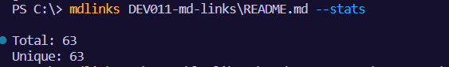

# Markdown Links
Markdown es un lenguaje de marcado ligero que se utiliza para formatear texto de una manera que sea fácil de leer y escribir, y que al mismo tiempo pueda ser convertido de manera sencilla a HTML u otros formatos.

La idea detrás de Markdown es que sea tan legible como sea posible sin parecer "marcado" con etiquetas o códigos. Utiliza una sintaxis simple basada en caracteres especiales y símbolos para aplicar formato a texto, como encabezados, listas, enlaces y énfasis, entre otros.

## Algunos ejemplos de la sintaxis de Markdown son:

* Encabezados
* Listas
* Enlaces

Este último en ocasiones vienen rotas o invalidas ocasionando que la información se comparte pierda valor, por dicha razón se desarrolló una librería para  la validación de links de un archivo markdown.

***

# Descripción

La librería tiene el objetivo de leer el archivo markdow, leer el contenido, enlistar los links que esta contiene, al validarlas muestra los estatus de los links y muestra los datos estadísticos de la misma 

* Lista de links


* Lista de links validados


* Datos estadísticos 



* Datos estadísticos validados


***
# Instalación

para la instalación de de la librería se utiliza lo siguiente:

* mediante consola

```shell

`npm lp-md-links
```

*** 
# Uso de la librería 

mediante el uso de los argumentos descritos a continuación se podrán visualizar los la lista de urls validas y datos estadísticos de cada uno

`path`: ruta del archivo con extensión: `.md`, `.mkd`, `.mdwn`, `.mdown`, `.mdtxt`, `.mdtext`, `.markdown`, `.text`

`--validate`: enlista las urls con el estatus de cada uno

`--status`: muestra el total de links que se encuentran dentro del directorio

Lista de links

```shell
`md-links <path-to-file>
```


Lista de links validados

```shell
`md-links <path-to-file> --validate`
```


Datos estadísticos 

```shell
`md-links <path-to-file> --stats`
```


Datos estadísticos validados

```shell
`md-links <path-to-file> --stats --validate`
```


***
# test realizados


